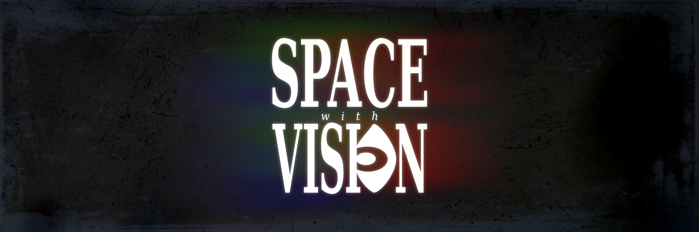

## About
Making motion pictures, like all art, is an active process — transforming a subject from an inert state of merely being observed, into an experience that is immersive and experiential. A space with vision is a place that serves as a chrysalis for this process: it is a zone of creativity where meaningful creative works are produced and shared.

This publication documents various expeditions into the dynamic creative process and philosophy of crafting motion pictures.

## Where to Read
Currently, the primary platform for Space with Vision is [Substack](https://spacewithvision.substack.com), yet knowing how the winds of time change every platform, we're currently looking into other ways of preserving our work for readers.  Materials we post on Github and Archive.org are a result of our current experiment in finding new and interesting ways to provide access to our work without getting locked into a single platform.

## Support
If you like the work we're doing here, please consider [sponsoring this project](https://github.com/sponsors/peterjhaas)!

## Catalog

### 2026
- **You Are All Wrong**
  - *Defending Herzog's Ecstatic Truth at New York's Metrograph Movie Theater.*
  - by Peter J. Haas 
  - Read: [Substack](https://spacewithvision.substack.com/p/you-are-all-wrong?r=63z57c) - [GitHub](./2026/YouAreAllWrong.md)

  

2025
  

- **Soundtracks, The Last Unicorn**
  - *Examining an underrated gem of an original sound track as magical as the film itself.*
  - by Kat Hamilton
  - Read: [Substack](https://spacewithvision.substack.com/p/soundtracks-the-last-unicorn?r=63z57c)
- **Masks**
  - *On the subject of fast-fashion and the occupation of the inner-space of our souls.*
  - by Peter J. Haas, photography by Léa Fae
  - Read: [Substack](https://spacewithvision.substack.com/p/masks?r=63z57c)
- **To Quote Werner Herzog**
  - *Regarding the time we made a Werner Herzog zine at the Rogue Film School.*
  - by Peter J. Haas
  - Read: [Substack](https://spacewithvision.substack.com/p/to-quote-werner-herzog)
- **To the Moon and Back Again**
  - *Méliès, Visual effects magic, and the persistence of memory.*
  - by Peter J. Haas
  - Read: [Substack](https://spacewithvision.substack.com/p/to-the-moon-and-back-again)
- **Halloween Special 2025**
  - *The truth about ghosts revealed! Or, that Time Peter was Attacked by a Ghost!*
  - by Peter J. Haas
  - Read: [Substack](https://spacewithvision.substack.com/p/halloween-special?r=63z57c)
- **Read, Read, Read...**
  - *Werner Herzog Drops the Bomb. Dispatches from the Rogue Film School regarding ecstatic cinema, truth, and facts.*
  - by Peter J. Haas
  - Read: [Substack](https://spacewithvision.substack.com/p/read-read-read?r=63z57c)

